# Miaoma Todo 全平台产品研发方案 v0.2（评审稿）

> 本文档为 Miaoma Todo 任务管理工具的首版研发评审方案，覆盖产品定位、竞品分析、用户研究、功能 PRD、多端设计、商业化体系、技术架构、质量保障、部署发布全链路内容。
> 当前为 v0.2 版本，在 v0.1 基础上补充了架构图、流程图、信息架构图等可视化内容，用于团队内部方向评审与研发排期参考。

---

## 一、产品定位与核心目标

### 1.1 产品定位

Miaoma Todo 是一款面向**个人用户、家庭用户与小型团队**的轻量任务管理工具，核心解决四件事：

- 快速记录想法与待办事项
- 将任务合理安排到对应时间节点
- 执行过程中提供专注辅助与进度反馈
- 跨设备可靠同步，保证数据一致性

产品不做复杂的企业级项目管理工具，也不堆砌全量生产力功能。首期核心目标：让用户在 **30 秒内完成一次任务记录，1 分钟内完成当日计划排布**。

### 1.2 产品愿景

> 让任务的记录、安排与执行变得简单、可靠、连续。

### 1.3 核心体验闭环

用户从打开应用到完成任务的完整日常工作流如下：


### 1.4 首期核心指标

| 指标 | 目标方向 |
| --- | --- |
| 新用户首次创建任务耗时 | ≤ 30 秒 |
| 新用户首次完成任务耗时 | 注册后 10 分钟内 |
| 用户次日留存率 | 核心观测指标，验证产品粘性 |
| 周活跃用户人均任务完成数 | 验证产品是否进入用户日常工作流 |
| 多端同步成功率 | ≥ 99.9% |
| 提醒准时送达率 | ≥ 99% |
| Inbox 任务清空到 Today 的平均时长 | 持续优化缩短 |
| 免费用户转付费转化率 | 验证付费价值感知 |

---

## 二、竞品深度调研与产品机会

本次调研以 **Things 3** 为交互与结构标杆，以 **TickTick（滴答清单）** 为功能与商业化参考，结合国内用户使用习惯做差异化设计。

### 2.1 标杆竞品：Things 3

Things 3 是苹果生态经典 GTD 工具，核心价值在于**清晰、克制与极致体验**。

#### 核心信息架构

采用分层收纳逻辑：Inbox → Today / This Evening → Upcoming → Anytime / Someday → Areas（区域）→ Projects（项目）→ Headings（分组）→ Tasks（任务），配套 Tags、Checklists 辅助管理。

#### 核心优势

- 信息结构极简，学习成本极低，日常计划路径短
- 视觉干扰少，动效细腻，专注感强
- Mac 端键盘快捷键完善，桌面端效率极高
- iPad 端拖拽、多选交互成熟，适配大屏触控
- 任务详情信息充足，但默认保持简洁，按需展开

#### 商业模式

纯苹果生态**买断制**，Mac、iPhone、iPad、Vision Pro 分平台独立定价，一次购买永久使用，无订阅、无内购广告。

#### 明显短板

- 仅覆盖 Apple 生态，跨平台能力缺失
- 团队协作、共享评论、权限管理能力极弱
- 缺少习惯追踪、番茄钟、复杂日历视图等效率功能
- 对中国本地化服务、通知渠道支持不足

### 2.2 标杆竞品：TickTick（滴答清单）

TickTick 是全平台综合型效率工具，方向更宽，覆盖任务、日程、专注、习惯全场景。

#### 核心能力矩阵

除基础任务管理外，包含多视图日历、习惯追踪、番茄专注、倒计时、看板视图、任务时长、邮件提醒、主题皮肤、数据统计、小组件、团队共享、第三方集成等。

#### 免费版限制

- 9 个清单，单清单 99 条任务
- 每天 1 个附件，单任务 19 个清单项
- 2 个任务提醒，2 人共享，5 个习惯/倒计时

#### 付费版增值

提升容量上限，解锁全量日历视图、任务时间段、邮件提醒、高级主题、高级统计、团队协作等能力，年费约 139 元人民币。

#### 优势与不足

- **优势**：平台覆盖全，功能大而全，适合希望一站式管理时间的用户
- **不足**：功能密度高，长期使用认知成本高；首页信息繁杂，不适合快速记录场景

### 2.3 竞品对比与产品差异化机会

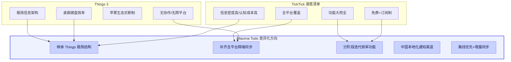

| 竞品能力 | Miaoma Todo 设计取舍 |
| --- | --- |
| Things 3 的任务分层结构 | 作为产品核心骨架，继承极简信息架构 |
| Things 3 的快捷输入与纯净界面 | 作为桌面端核心体验标准 |
| TickTick 的全平台覆盖能力 | 作为基础能力，实现五端同步 |
| TickTick 的日历、习惯、专注功能 | 分阶段迭代，不堆砌在首期版本 |
| TickTick 的共享与团队功能 | 作为 Pro / Team 版付费增值点 |
| 中国用户本地化需求 | 新增微信、钉钉、飞书通知渠道，中文自然语言识别 |
| 多端同步体验 | 采用离线优先 + 增量同步机制，保证弱网可用性 |

> 产品第一阶段集中打磨任务管理核心能力；日历、习惯、AI、团队功能基于稳定的任务模型逐步迭代。

---

## 三、目标用户群体

### 3.1 核心用户群体

#### 个人职场用户

日常面临大量会议、工作事项与临时任务，核心需求：快速记录任务、按日期排布、处理重复工作、跨设备同步、到期提醒、全局搜索。愿意为稳定同步、桌面效率、日历视图付费。

#### 学生与备考用户

需要管理课程、作业、考试、复习计划，核心需求：按项目整理任务、设置截止日期、拆分阶段目标、重复提醒、周计划查看、专注计时、完成记录。

#### 自由职业者与创作者

同时处理多个客户、项目与个人目标，核心需求：按客户建立项目、记录交付节点、区分工作生活、多标签分类、周期性任务管理、看板与日历视图、跨设备操作。

#### 家庭用户

家庭成员共同处理采购、旅行、家务、育儿等事务，核心需求：共享清单、任务指派、评论附件、到期提醒、进度查看、共同规划生活事项。

### 3.2 用户需求与付费意愿矩阵

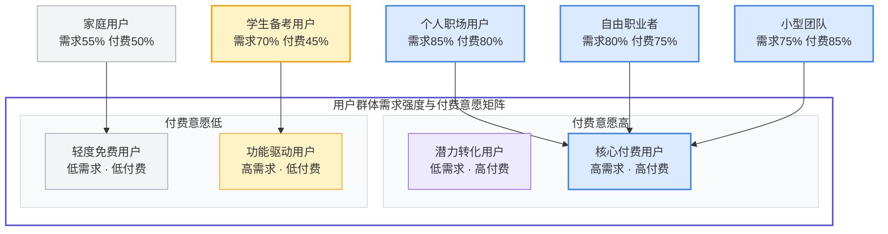

### 3.3 次要用户群体

- 5-20 人规模小型工作室与创业团队
- 需要同时管理个人任务与团队任务的管理者
- 对中文任务管理与本地化通知有强需求的用户
- 从纸笔、备忘录、聊天工具迁移的初级效率用户

### 3.4 首期非重点服务人群

首期不服务大型企业、复杂研发项目、多层级项目管理团队。此类用户需求的复杂权限、审批流、甘特图、工时核算、预算管理、企业 SSO、组织架构同步、审计报表等能力会大幅提升系统复杂度，待个人与小团队产品稳定后再评估拓展。

---

## 四、产品设计原则

### 4.1 输入要快

记录任务无需先选择项目、标签、优先级、日期。默认流程：输入任务标题 → 系统自动识别日期时间 → 按需补充属性，最大限度降低输入门槛。

### 4.2 计划要清

首页默认只展示当日待处理任务；过去任务、未来任务、搁置任务分区显示，避免所有内容挤压在同一列表造成信息过载。

### 4.3 详情渐进式展开

任务默认仅展示标题与完成状态；备注、标签、清单、附件、提醒等信息收纳至详情面板，用户需要时再展开，保持界面整洁。

### 4.4 全端离线可用

所有端均支持离线创建、编辑、完成任务，本地缓存数据；网络恢复后通过同步机制自动合并变更，不因为网络问题中断用户操作。

### 4.5 数据所有权归用户

订阅到期后保留全部历史数据；降级免费版后，仅停止高级功能使用，任务、项目、备注等用户数据永久保留，支持随时导出。

---

## 五、信息架构与核心功能 PRD

### 5.1 整体信息架构

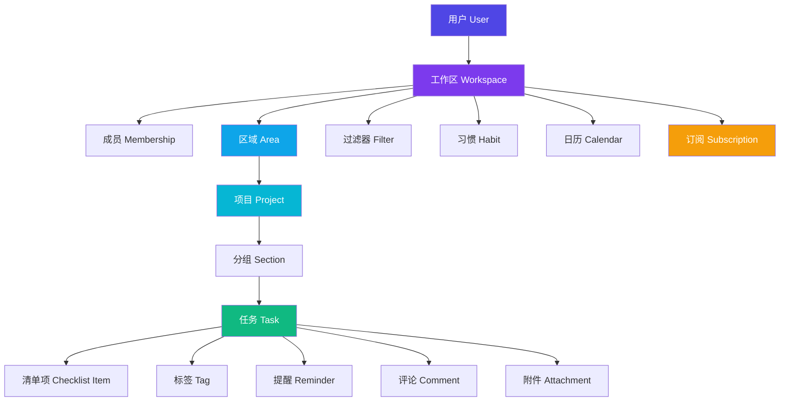

- **区域 Area**：划分长期生活责任，如工作、个人、家庭、学习、健康、财务
- **项目 Project**：有明确目标的任务集合，如发布课程、旅行计划、产品上线、搬家
- **分组 Section**：项目内的阶段/主题拆分，如前期准备、设计、开发、测试、发布
- **任务 Task**：最小可执行工作单元
- **清单 Checklist**：任务内部的细分步骤，如出差准备下的订机票、带证件等

### 5.2 核心功能模块详细设计

#### 5.2.1 账户与工作区

- **登录方式**：手机号、邮箱、微信、Apple、Google 登录，支持密码与验证码登录
- **工作区类型**：个人工作区、家庭工作区、团队工作区
- **成员角色与权限**：

| 角色 | 权限范围 |
| --- | --- |
| Owner | 管理工作区、成员、订阅与全部内容 |
| Admin | 管理成员与共享内容 |
| Member | 创建、编辑、完成任务 |
| Viewer | 仅查看内容，不可编辑 |

#### 5.2.2 Inbox 收集箱

所有临时任务的统一入口，主打极速录入。

- **核心能力**：快速创建、全局快捷键唤起、移动端悬浮按钮、语音输入、中文自然语言日期识别、自动识别标签与时间、自动匹配重复规则、离线创建、批量整理
- **自然语言示例**：输入"周五下午三点提醒我给客户发报价单 #客户A"，系统自动识别为：
  - 标题：给客户发报价单
  - 日期：本周五
  - 时间：15:00
  - 标签：客户A
  - 提醒：15:00
- **整理动作**：移动到 Today、指定日期、移动到项目、添加标签、设置优先级、转为重复任务、放入 Someday、删除、批量归档

#### 5.2.3 任务核心字段与状态

| 字段 | 必选 | 说明 |
| --- | --- | --- |
| id | 是 | 全局唯一 ID |
| title | 是 | 任务标题 |
| description | 否 | Markdown 格式备注 |
| status | 是 | 未完成、已完成、已归档 |
| priority | 否 | 无、低、中、高 |
| start_at | 否 | 开始时间 |
| due_at | 否 | 截止时间 |
| reminder_at | 否 | 提醒时间 |
| repeat_rule | 否 | 重复规则配置 |
| project_id / section_id | 否 | 所属项目与分组 |
| assignee_id | 否 | 执行人 |
| tag_ids | 否 | 关联标签 |
| checklist | 否 | 子清单项 |
| estimate_minutes / actual_minutes | 否 | 预计与实际耗时 |
| 审计字段 | 是 | 创建人、创建时间、更新时间、完成时间 |

**任务状态流转**：

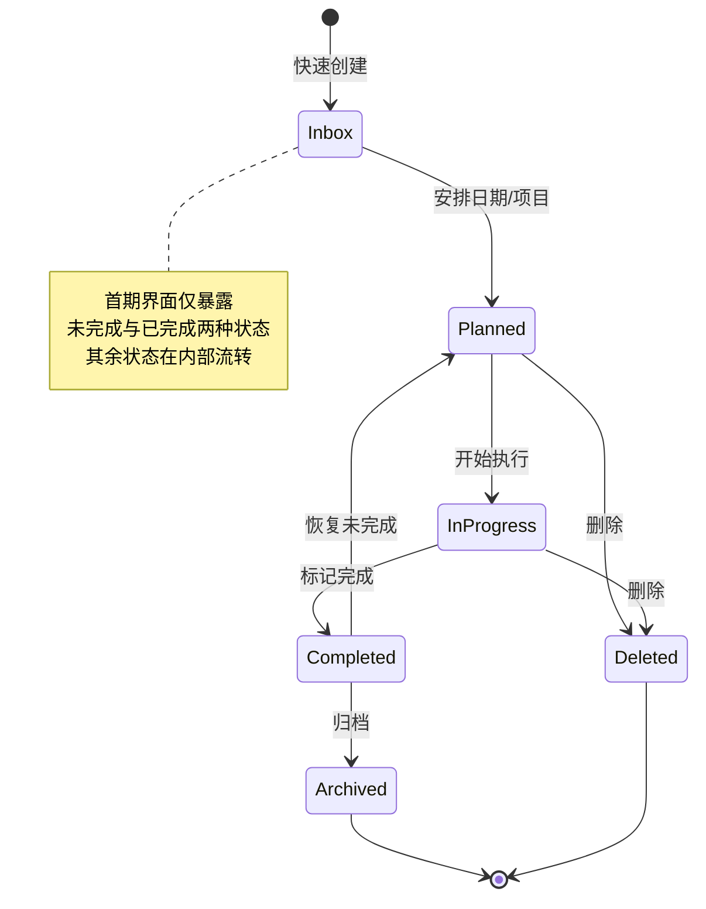

#### 5.2.4 Today 今日视图

默认首页，聚焦当日待办。

- **页面分区**：已逾期 → 上午 → 下午 → This Evening；无具体时间的任务归入"全天任务"区域
- **核心操作**：完成任务、拖拽排序、修改时间、移动日期、添加提醒、批量操作、进入专注模式、查看当日日历事件
- **设计要求**：任务标题为视觉主体，其他信息以小标签、颜色、图标呈现，默认不显示冗余设置项。

#### 5.2.5 Upcoming 未来视图

用于中长期计划排布。

- **视图模式**：按天查看、按周查看、按月查看、日历视图、列表视图
- **核心操作**：拖拽调整日期、显示重复任务、标记截止日期、同步日历事件
- **端侧差异**：桌面端采用列表+日历双栏布局；手机端默认时间轴列表，点击日期进入当日详情。

#### 5.2.6 项目与分组管理

- **项目属性**：标题、描述、颜色、图标、截止日期、成员、进度、分组、归档、共享
- **视图切换**：列表视图、看板视图、时间线视图、日历视图；首期优先实现列表与看板视图
- **进度计算**：按已完成任务数量统一计算，规则全产品一致，避免进度显示与实际状态不一致。

#### 5.2.7 重复任务与提醒体系

- **重复规则**：每天、每周、每月、每年、工作日、每周指定日期、每月指定日期、自定义间隔、截止日重复、完成后间隔重复
- **完成逻辑**：重复任务完成后自动生成下一次实例；支持仅完成本次、完成全部后续、跳过本次、修改整体规则
- **提醒方式**：应用内提醒、系统推送、邮件提醒；Pro 版支持微信、钉钉、飞书通知

#### 5.2.8 标签与智能过滤器

- **标签**：预置工作、家庭、等待、电话、电脑、外出、高优先级等标签，支持用户自定义
- **过滤器**：支持多条件组合筛选，包括标签、项目、区域、优先级、日期、逾期状态、执行人、附件状态、完成状态等

#### 5.2.9 全局搜索

- **覆盖范围**：任务标题、备注、项目名称、标签、评论、附件名称、完成人、创建人
- **端侧适配**：桌面端支持快捷键唤起（Cmd/Ctrl + K）；手机端支持顶部搜索与语音搜索
- **结果呈现**：展示任务所在位置，支持直接跳转到对应项目或日期视图。

#### 5.2.10 专注模式

- **能力**：25 分钟番茄钟、50 分钟专注、自定义时长、暂停/结束、自动记录实际耗时、完成任务、自动进入下一任务、专注历史统计
- **设计原则**：不强制绑定番茄钟，用户可仅使用计时器，也可关闭计时功能。

#### 5.2.11 习惯追踪（第二阶段）

- 区分任务（一次性工作）与习惯（周期性行为）
- 支持每天/每周习惯、目标次数、连续记录、完成率、提醒、统计、跳过、补记

#### 5.2.12 团队协作

- **共享项目（首期）**：邀请成员、任务指派、评论、@提及、附件、活动记录、完成通知、权限控制、退出共享
- **团队版（后续）**：团队工作区、成员管理、角色分组、账单管理、审计日志、组织设置、域名邀请、单点登录

#### 5.2.13 同步与离线机制

同步是整个产品的基础能力，采用**离线优先 + 增量同步**架构：

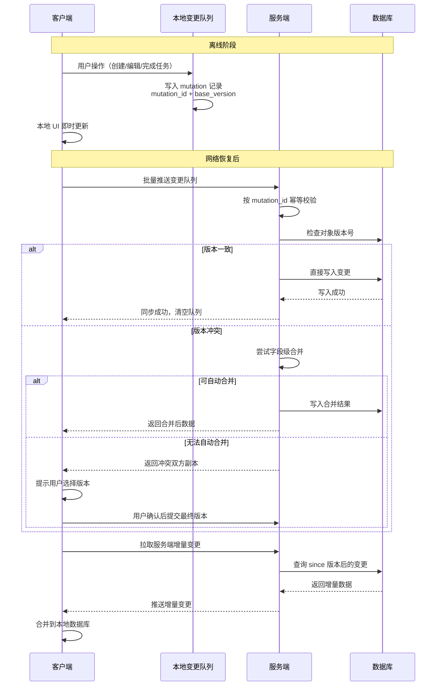

- **离线能力**：离线状态支持全量任务操作，本地缓存最近数据
- **同步机制**：客户端维护本地变更队列，每条变更携带 mutation_id、client_id、实体信息、版本号；服务端通过 mutation_id 保证幂等
- **冲突处理**：服务端保存对象版本号，版本一致直接写入；版本冲突尝试字段合并；标题/备注冲突保留双方副本，用户手动选择版本，确保不丢失数据。

---

## 六、多端设计规范

采用**两套设计体系、覆盖五端形态**的策略：大屏端（Web + 桌面端）共用一套设计，小屏端（手机 + Pad）共用一套设计，保证体验一致性与平台适配性。

### 6.1 大屏端设计规范（Web端 + 桌面端）

#### 6.1.1 布局结构

标准三栏式固定布局，尺寸建议：

```
┌──────────────┬────────────────────┬────────────────────────┐
│ 左侧导航栏     │ 任务列表区          │ 任务详情面板            │
│ 240px        │ 380 - 520px       │ 420 - 600px           │
│              │                    │                        │
│ Inbox        │ Today              │ 标题 + 状态            │
│ Today        │ 任务 A             │ 描述（Markdown）       │
│ Upcoming     │ 任务 B             │ 子清单                 │
│ Areas        │ 任务 C             │ 标签 + 提醒            │
│ Projects     │                    │ 评论 + 附件            │
│ Tags         │                    │                        │
└──────────────┴────────────────────┴────────────────────────┘
```

顶部为全局搜索栏与快捷操作区。

#### 6.1.2 桌面端专属能力

全局快捷键（回车创建、空格完成、Cmd/Ctrl+K 搜索、Cmd/Ctrl+Enter 保存）、拖拽排序、多选任务、系统托盘、桌面通知、多窗口、深色模式、自动更新、快速捕获窗口。

#### 6.1.3 Web端专属能力

浏览器直接访问、响应式布局、多标签页、断网提示、浏览器通知、PWA 安装，与桌面端共享数据与路由逻辑。

#### 6.1.4 响应式适配规则

| 屏幕宽度 | 页面形态 |
| --- | --- |
| 1440px 以上 | 三栏完整布局 |
| 1200 - 1439px | 侧栏 + 任务区，详情面板折叠 |
| 768 - 1199px | 双栏布局 |
| 767px 以下 | 切换为移动端布局 |

### 6.2 小屏端设计规范（手机端 + Pad端）

#### 6.2.1 手机端交互设计

- **底部导航**：Today、Inbox、Lists、Focus 四个一级入口，更多功能（Upcoming、Calendar、Habits、Search、Settings、Subscription）放入 More 页面
- **快速新增**：右下角悬浮按钮，默认仅显示标题输入框，点击展开日期、时间、项目、标签、优先级等属性
- **手势操作**：侧滑呼出操作菜单、长按拖拽排序、下拉刷新

#### 6.2.2 Pad端交互设计

- 布局：左右分栏结构（导航侧栏 280px + 任务列表 500-700px + 详情面板）
- 核心适配：横屏三栏、竖屏双栏、外接键盘支持、多选拖拽、Apple Pencil 交互、桌面小组件、分屏模式

#### 6.2.3 移动端系统能力

推送通知、锁屏快捷操作、桌面小组件、系统语音入口、分享菜单快速保存、深链接、后台同步、生物识别锁定。

### 6.3 多端设计体系总览

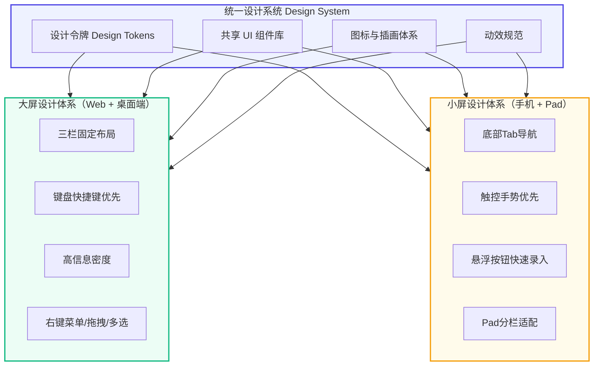

---

## 七、商业化与付费规则

采用「免费基础版 + 个人专业版 + 团队协作版」三层体系，适配国内市场定价，以下为草案价格，最终根据首批用户转化率调整。

### 7.1 版本权益对比


### 7.2 Free 免费版

适合个人轻度使用，包含：

- 无限基础任务数量
- Inbox、Today、Upcoming 列表视图
- 基础项目与标签能力
- 3 个共享项目
- 基础提醒与多端同步
- 7 天历史统计
- 单设备离线缓存
- 基础主题皮肤

### 7.3 Pro 个人专业版

- **定价**：18 元/月，168 元/年
- **权益**：
  - 无限项目与区域
  - 日历视图、看板视图
  - 高级过滤器与智能清单
  - 中文自然语言日期识别
  - 增强版重复任务规则
  - 多级提醒与多渠道通知
  - 任务时长统计与实际耗时记录
  - 番茄专注 + 习惯追踪
  - 附件存储空间扩容
  - 完整历史数据统计
  - 多设备离线同步
  - 邮件、微信、钉钉、飞书通知
  - 高级主题皮肤
  - AI 任务拆解额度
  - 数据导出
  - 优先客户支持

### 7.4 Team 团队协作版

- **定价**：29 元/人/月，288 元/人/年
- **权益**：
  - 团队工作区
  - 角色权限管理
  - 共享项目与任务指派
  - 评论与 @成员提及
  - 活动操作记录
  - 团队数据统计
  - 管理员控制台
  - 成员与席位管理
  - 统一账单与发票
  - 数据批量导出
  - 操作审计日志
  - 团队通知策略

### 7.5 订阅到期与降级规则

- 订阅到期后，用户已有任务、项目、附件等数据全部保留
- 可继续查看与完成已有任务，高级视图与新建高级功能受限
- 附件保留一定期限，支持随时导出数据
- 重新订阅后立即恢复全部高级权益
- 不因为订阅到期直接删除任何用户数据

### 7.6 退款政策

- Web 端支付遵循平台退款规则
- App Store / Google Play 渠道按对应平台规则处理
- 微信、支付宝支付遵循对应支付渠道售后规则
- 订阅购买后 7 天内可申请无理由退款
- 已消耗的增值服务额度单独核算

---

## 八、技术架构设计

### 8.1 整体架构总览

采用**前后端分离 + 多端适配 + 容器化部署**的分层架构，代码基于 pnpm Monorepo 统一管理，前端覆盖 Web/H5、移动端、桌面端三端形态，服务端按职责拆分三套技术栈，基建层基于 Docker 标准化编排。

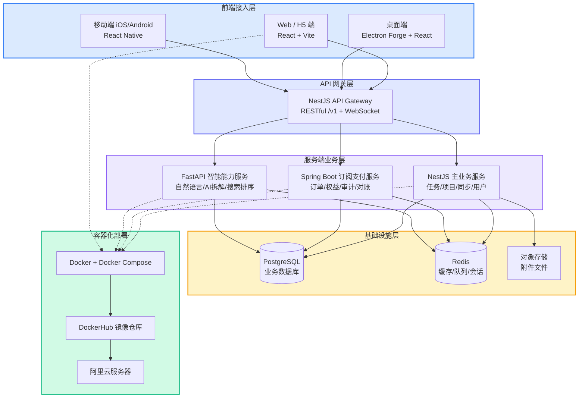

### 8.2 Monorepo 代码仓库架构

基于 pnpm workspace 实现单仓库多项目管理，统一依赖版本、共享公共代码、简化构建流程。

```mermaid
flowchart TD
    ROOT["miaoma-todo/ 根目录"]

    ROOT --> APPS["apps/ 前端应用"]
    APPS --> APP_WEB["web/ Web + H5<br/>React + Vite"]
    APPS --> APP_DESK["desktop/ 桌面端<br/>Electron Forge"]
    APPS --> APP_MOB["mobile/ 移动端<br/>React Native"]

    ROOT --> SERVICES["services/ 服务端应用"]
    SERVICES --> SVC_NEST["api-nest/<br/>NestJS 主业务"]
    SERVICES --> SVC_SPRING["billing-spring/<br/>Spring Boot 订阅支付"]
    SERVICES --> SVC_FAST["intelligence-fastapi/<br/>FastAPI 智能能力"]

    ROOT --> PACKAGES["packages/ 公共共享包"]
    PACKAGES --> PKG_CONTRACT["contracts/<br/>API 接口契约"]
    PACKAGES --> PKG_TYPES["shared-types/<br/>通用类型定义"]
    PACKAGES --> PKG_CLIENT["api-client/<br/>API 请求客户端"]
    PACKAGES --> PKG_TOKENS["design-tokens/<br/>设计令牌"]
    PACKAGES --> PKG_UI["ui/<br/>通用 UI 组件库"]
    PACKAGES --> PKG_VALID["validation/<br/>表单校验规则"]
    PACKAGES --> PKG_FIXTURE["test-fixtures/<br/>测试数据夹具"]

    ROOT --> DOCKER_DIR["docker/ 容器化配置"]
    DOCKER_DIR --> DOCK_COMPOSE["compose/<br/>dev/test/prod 三套编排"]
    DOCKER_DIR --> DOCK_PG["postgres/"]
    DOCKER_DIR --> DOCK_REDIS["redis/"]
    DOCKER_DIR --> DOCK_SVC["各服务 Dockerfile"]

    ROOT --> TESTS_DIR["tests/ 统一测试"]
    TESTS_DIR --> TEST_UNIT["unit/ 单元测试"]
    TESTS_DIR --> TEST_INT["integration/ 集成测试"]
    TESTS_DIR --> TEST_FIX["fixtures/ 测试数据"]

    ROOT --> DOCS_DIR["docs/ 项目文档"]
    DOCS_DIR --> DOC_PRODUCT["product/"]
    DOCS_DIR --> DOC_PRD["prd/"]
    DOCS_DIR --> DOC_ARCH["architecture/"]
    DOCS_DIR --> DOC_QA["qa/"]
    DOCS_DIR --> DOC_RELEASE["release/"]

    style ROOT fill:#1E293B,color:#fff
    style APPS fill:#DBEAFE,stroke:#3B82F6
    style SERVICES fill:#EDE9FE,stroke:#8B5CF6
    style PACKAGES fill:#FEF3C7,stroke:#F59E0B
    style DOCKER_DIR fill:#D1FAE5,stroke:#10B981
    style TESTS_DIR fill:#FCE7F3,stroke:#EC4899
    style DOCS_DIR fill:#F3F4F6,stroke:#6B7280
```

### 8.3 前端技术栈与多端实现

| 端 | 核心技术栈 | 说明 |
| --- | --- | --- |
| Web / H5 | React 18 + TypeScript + Vite 5 | 路由 React Router v6，状态管理 Zustand + TanStack Query，UI 组件库 Ant Design，样式 Tailwind CSS |
| 桌面端 | Electron Forge + React 18 | 渲染层复用 Web 端业务代码，主进程封装系统能力，构建 exe/dmg 安装包 |
| 移动端 | React Native + TypeScript | 路由 React Navigation，状态管理同 Web 端，封装原生通知、相机、本地存储能力 |

- Web 与桌面端共享大部分 React 组件与业务逻辑
- 移动端共享类型定义、API Client、校验规则与无状态组件
- 本地存储：Web 端 IndexedDB，移动端 SQLite，保证离线可用

### 8.4 服务端技术栈与职责分工

三套服务按业务边界拆分，避免重复实现核心 CRUD，通过统一接口契约协作。

```mermaid
flowchart LR
    subgraph Nest["NestJS 主业务服务"]
        direction TB
        N1[登录与会话]
        N2["用户/工作区/成员"]
        N3["区域/项目/分组"]
        N4["任务/标签/过滤器"]
        N5["评论/附件元数据"]
        N6["同步接口/WebSocket"]
        N7[推送通知]
        N8["API Gateway + OpenAPI"]
    end

    subgraph Spring["Spring Boot 订阅支付服务"]
        direction TB
        S1[订阅计划管理]
        S2[订单与支付回调]
        S3[权益计算与校验]
        S4[团队席位管理]
        S5[发票与退款]
        S6[审计日志]
        S7[管理员操作]
        S8[对账任务]
    end

    subgraph Fast["FastAPI 智能能力服务"]
        direction TB
        F1[中文自然语言日期解析]
        F2[任务自动分类]
        F3[标签智能建议]
        F4[任务自动拆解]
        F5[内容摘要]
        F6[搜索排序优化]
        F7[统计计算]
        F8[AI 额度控制]
    end

    Nest -.->|调用权益校验| Spring
    Nest -.->|调用智能解析| Fast
    Fast -.->|可降级| Nest

    style Nest fill:#DBEAFE,stroke:#3B82F6,stroke-width:2px
    style Spring fill:#FEF3C7,stroke:#F59E0B,stroke-width:2px
    style Fast fill:#EDE9FE,stroke:#8B5CF6,stroke-width:2px
```

#### NestJS 主业务服务

面向客户端的核心 API 网关，负责：登录会话、用户资料、工作区、区域、项目、任务、标签、过滤器、评论、附件元数据、同步接口、WebSocket、推送通知、OpenAPI 文档。作为所有客户端的主访问入口。

#### Spring Boot 订阅支付服务

负责事务性强、规则稳定的商业化业务，包括：订阅计划、订单管理、支付回调、权益计算、团队席位、发票管理、退款处理、审计日志、管理员操作、对账任务。账单与订阅数据独立管理。

#### FastAPI 智能能力服务

负责计算型与 AI 相关接口，包括：中文自然语言日期解析、任务自动分类、标签建议、任务拆解、内容摘要、搜索排序、统计计算、AI 额度控制。该服务可降级，即使暂时下线也不影响基础任务功能使用。

### 8.5 数据层设计

- **业务数据库**：PostgreSQL，核心表包括 users、workspaces、memberships、areas、projects、sections、tasks、checklist_items、tags、reminders、repeat_rules、comments、attachments、sync_mutations、subscriptions、orders、audit_logs 等。所有业务表单表包含 id、workspace_id、审计字段、版本号，支持软删除。
- **缓存数据库**：Redis，承担登录会话、验证码、接口限流、热点数据缓存、WebSocket 发布订阅、提醒队列、异步任务、AI 额度控制、分布式锁等能力。

### 8.6 API 接口规范

- 所有客户端 API 统一使用 `/v1` 版本前缀
- 接口契约统一维护在 `packages/contracts`，基于 OpenAPI 生成各语言类型文件
- 统一错误格式：包含错误码、消息、请求 ID、详情字段
- 同步接口独立设计，支持增量拉取与变更推送

核心接口示例：

```
POST   /v1/auth/login          用户登录
GET    /v1/me                   获取当前用户
GET    /v1/workspaces           获取工作区列表
POST   /v1/tasks                创建任务
PATCH  /v1/tasks/:id            更新任务
DELETE /v1/tasks/:id            删除任务
GET    /v1/views/today          获取今日视图
GET    /v1/views/upcoming       获取未来视图
POST   /v1/sync/push            推送本地变更
GET    /v1/sync/pull            拉取服务端增量
POST   /v1/subscriptions/checkout  发起订阅
GET    /v1/subscriptions/current   获取当前订阅
```

### 8.7 安全设计规范

- 密码加密采用 Argon2 / bcrypt 算法
- 认证采用 JWT 短期令牌 + Refresh Token 轮换机制
- 设备管理与登录异常提醒
- API 全局限流，验证码接口单独限流
- 工作区级与资源级双重权限校验
- 敏感数据加密存储，数据库定期备份
- 文件上传类型限制，下载鉴权
- 服务间内部鉴权，生产环境禁止明文密码入库

---

## 九、质量保障与测试体系

建立**单元测试 + 集成测试**两级自动化测试体系，覆盖核心业务逻辑与端到端流程，保障迭代稳定性。

### 9.1 测试体系总览

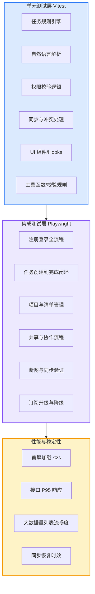

### 9.2 单元测试（Vitest）

#### 核心覆盖范围

1. **任务规则引擎**：创建/编辑/完成/恢复/删除、排序、优先级计算、截止/逾期判断、重复任务生成、清单完成率、项目进度计算
2. **自然语言解析**：中文日期、中文时间、相对日期、重复规则、时区处理、无法识别时的降级逻辑
3. **权限校验**：各角色权限边界、非成员访问拦截、被移除成员权限回收
4. **同步机制**：mutation_id 幂等性、离线变更队列、冲突处理、重复提交防重

自然语言解析测试用例：

```
明天下午三点
周五
下周一上午九点
每周一
每月最后一天
两小时后
本周末
```

### 9.3 集成测试（Playwright）

覆盖 Web 端核心业务流程的端到端验证，模拟真实用户操作路径。

| 用例编号 | 测试场景 | 验收标准 |
| --- | --- | --- |
| E2E-001 | 注册并创建首个任务 | 任务成功出现在 Inbox |
| E2E-002 | Inbox 任务移动到 Today | Today 视图正确展示任务 |
| E2E-003 | 设置日期与提醒 | 提醒配置正确生效 |
| E2E-004 | 创建重复任务 | 完成后自动生成下一次实例 |
| E2E-005 | 创建项目与分组 | 任务可归属到对应项目分组 |
| E2E-006 | 邀请成员加入共享项目 | 被邀请成员可访问项目 |
| E2E-007 | 任务指派 | 被指派人收到通知并看到任务 |
| E2E-008 | 修改成员权限 | Viewer 角色无法编辑内容 |
| E2E-009 | 断网创建任务 | 恢复网络后任务自动同步不丢失 |
| E2E-010 | 订阅升级 | Pro 权益立即生效 |
| E2E-011 | 订阅到期降级 | 数据保留，高级功能停用 |
| E2E-012 | 删除任务与恢复 | 回收站可找回已删任务 |
| E2E-013 | 多端数据同步 | Web 与桌面端状态一致 |
| E2E-014 | 移动端新增任务 | API 返回字段完整正确 |
| E2E-015 | 全局搜索 | 正确返回标题/备注/标签匹配结果 |

### 9.4 核心性能指标

- 首屏加载时间 ≤ 2 秒
- Today 视图首次渲染 ≤ 1 秒
- 创建任务接口 P95 响应 ≤ 300ms
- 普通搜索 P95 响应 ≤ 500ms
- 同步接口 P95 响应 ≤ 800ms
- 1000 条任务列表滚动无卡顿
- 断网恢复后 10 秒内完成全量同步

---

## 十、DevOps 与发布部署方案

### 10.1 容器化基础设施

统一基于 Docker 实现环境标准化，使用 Docker Compose 进行服务编排。

- **本地开发环境**：一键启动 PostgreSQL、Redis、三套业务服务、Web 前端、测试依赖
- **镜像选型**：数据库与缓存使用官方最新稳定镜像；开发环境用 latest 标签，生产环境锁定具体版本号与镜像 Digest

### 10.2 镜像构建规范

每个服务采用多阶段构建，最小化运行时镜像体积，使用非 root 用户启动，提供健康检查接口。

镜像命名规范：

```
[命名空间]/miaoma-todo-api-nest:[版本号]
[命名空间]/miaoma-todo-billing-spring:[版本号]
[命名空间]/miaoma-todo-intelligence-fastapi:[版本号]
[命名空间]/miaoma-todo-web:[版本号]
```

同时打 latest 标签与对应版本号标签，支持版本追溯与回滚。

### 10.3 完整发布流程

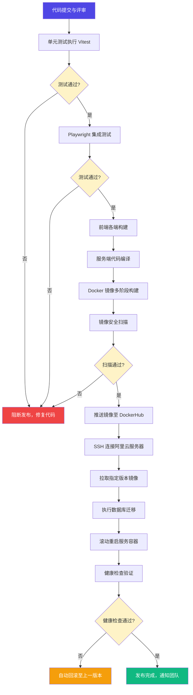

### 10.4 云端部署方案

1. **镜像分发**：构建完成的服务端镜像统一推送至 DockerHub 镜像仓库
2. **阿里云部署**：通过 SSH 协议连接目标服务器，拉取最新镜像，基于 Docker Compose 滚动更新服务，执行健康检查确认部署成功
3. **敏感信息**：服务器账号、密钥、数据库密码、API 密钥等配置通过环境变量注入，不写入代码仓库

阿里云部署所需参数清单：

- 服务器公网 IP / SSH 用户名 / SSH 私钥
- DockerHub 用户名 / Token / 镜像命名空间
- 数据库密码 / Redis 密码 / JWT 密钥
- 域名 / HTTPS 证书
- 支付平台密钥
- 微信、钉钉、飞书通知配置

### 10.5 完整发布产物清单

| 产物分类 | 产物名称 | 格式/类型 | 交付方式 | 部署/分发位置 |
|----------|----------|-----------|----------|--------------|
| 前端Web产物 | Web端静态资源包 | dist目录（HTML/CSS/JS） | 自动构建 | 阿里云 Nginx / CDN |
| 前端桌面产物 | Windows 桌面安装包 | .exe | 手动分发 | 用户本地安装 |
| 前端桌面产物 | macOS 桌面安装包 | .dmg | 手动分发 | 用户本地安装 |
| 前端移动产物 | Android 应用安装包 | .apk | 手动分发 | 应用市场 / 内测平台 |
| 前端移动产物 | iOS 应用安装包 | .ipa | 手动分发 | App Store / TestFlight |
| 服务端镜像 | NestJS 主业务镜像 | Docker 镜像 | DockerHub 推送 | 阿里云 Docker 容器 |
| 服务端镜像 | Spring Boot 订阅支付镜像 | Docker 镜像 | DockerHub 推送 | 阿里云 Docker 容器 |
| 服务端镜像 | FastAPI 智能能力镜像 | Docker 镜像 | DockerHub 推送 | 阿里云 Docker 容器 |
| 基建镜像 | PostgreSQL 数据库 | 官方镜像 | 直接拉取 | 阿里云 Docker 容器 |
| 基建镜像 | Redis 缓存 | 官方镜像 | 直接拉取 | 阿里云 Docker 容器 |
| 配置文件 | Docker Compose 编排文件 | .yml | 同步更新 | 阿里云服务器部署目录 |

---

## 十一、研发阶段规划

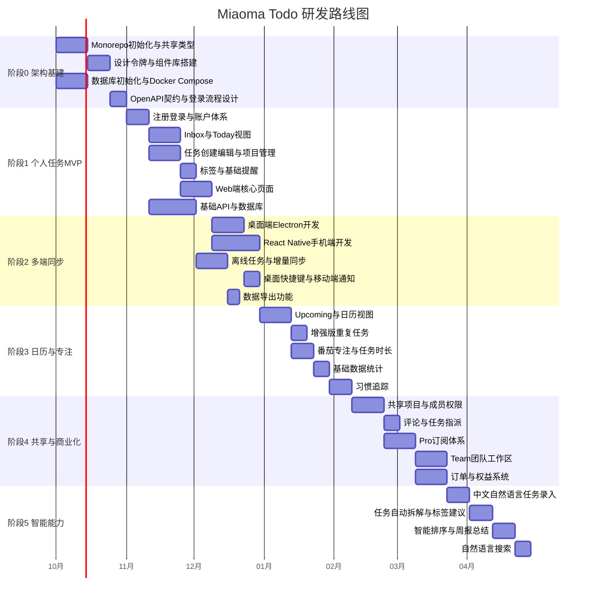

### 阶段 0：架构与设计基建

**目标**：搭建 Monorepo 框架、共享类型与设计令牌、数据库初始化、Docker Compose 开发环境、OpenAPI 接口契约、登录流程设计、核心页面原型。

### 阶段 1：个人任务 MVP

**目标**：实现注册登录、Inbox、Today、任务创建编辑、项目管理、标签、截止日期、基础提醒、Web 端、核心 API、数据库与缓存。交付可使用的最小闭环版本。

### 阶段 2：多端同步体验

**目标**：桌面端开发、React Native 手机端开发、离线任务能力、增量同步机制、桌面快捷键、移动端通知、数据导出。实现三端数据一致。

### 阶段 3：日历与效率工具

**目标**：Upcoming 视图、日历视图、增强版重复任务、番茄专注模式、任务时长统计、基础数据统计、习惯追踪。完善个人效率场景。

### 阶段 4：共享与商业化

**目标**：共享项目、成员权限、评论与指派、Pro 订阅体系、Team 团队工作区、订单与权益系统、支付对接。完成商业化闭环。

### 阶段 5：智能能力增强

**目标**：中文自然语言任务录入、任务自动拆解、标签智能建议、智能排序、周报自动总结、自然语言搜索。提升产品差异化竞争力。

---

## 十二、首期验收标准与待评审事项

### 12.1 MVP 版本验收标准

达到以下条件方可进入小范围内测：

1. 用户可完成注册登录全流程
2. 用户可在 30 秒内创建一条任务
3. 任务可进入 Inbox 并移动到 Today
4. 可设置任务日期、优先级、标签
5. 支持任务完成、删除与恢复
6. 可创建项目并管理任务归属
7. Web 端与桌面端数据实时一致
8. 断网状态可正常操作，恢复网络数据不丢失
9. 数据库具备备份与回滚策略
10. 核心业务逻辑单元测试覆盖
11. 主流程 Playwright 集成测试通过
12. Docker Compose 可一键启动开发环境
13. 生产镜像可正常启动并通过健康检查
14. 发布流程具备回滚机制

### 12.2 待重点确认决策项

以下决策将直接影响后续研发工作量，需评审确认：

1. **产品范围**：是否同意首期以个人任务管理为主，复杂企业项目管理延后迭代
2. **商业模式**：是否同意免费版 + Pro 个人版 + Team 团队版三层付费结构
3. **AI 能力节奏**：是否同意将自然语言、任务拆解、智能搜索放在第二阶段，优先保障基础任务系统稳定性
4. **服务端分工**：是否同意 NestJS 做主业务 API、Spring Boot 做订阅支付、FastAPI 做智能能力的技术分工
5. **本地化方向**：是否将微信、钉钉、飞书通知作为国内版本的核心差异化功能

---

## 参考资料

- [Things 官方产品页](https://culturedcode.com/things/)
- [Things 官方功能页](https://culturedcode.com/things/features/)
- [Things 官方定价说明](https://culturedcode.com/things/pricing/)
- [TickTick 官方介绍](https://ticktick.com/about)
- [TickTick 官方定价页](https://ticktick.com/upgrade)

---

> **整体判断**：该产品方向具备明确的市场空间与差异化机会，首版建议严格控制范围，优先打磨 Inbox、Today、Upcoming、项目、重复任务、同步与跨端体验这些核心能力；习惯、AI、复杂团队功能基于稳定版本逐步叠加。
